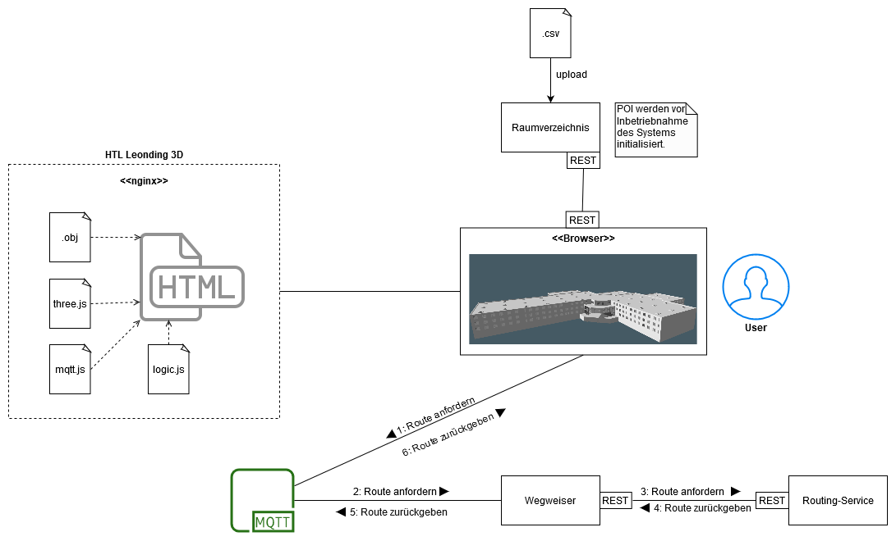

= 3D-HTL-Leonding-Tag der offenen Tür - Auinger & Tripić - 5BHIF 2019/2020
Philipp Auinger <philipp-auinger@gmx.at>, Nenad Tripić  <tripicnenad@hotmail.com>
v1.0, 2020-03-27
:toc:
:toc-title: Inhaltsverzeichnis
:toclevels: 3
:sectnums:

ifdef::env-github[]
:tip-caption: :bulb:
:note-caption: :information_source:
:important-caption: :heavy_exclamation_mark:
:caution-caption: :fire:
:warning-caption: :warning:
endif::[]

== Pflichtenheft - 3D-HTL-Leonding-Tag der offenen Tür

=== Ausgangssituation
Die HTL Leonding ist eine HTL im oö. Zentralraum mit ca. 1000 Schülern und den Fachabteilungen Medientechnik, Informatik, Elektronik und Medizintechnik. Jedes Jahr kommen hunderte Schüler von Unterstufen zum Tag der offenen Tür um sich die tollen Projekte der Schüler der HTL-Leonding anzusehen und um ein Gefühl für die Schule zu bekommen.

=== Istzustand
Wenn man die Schule betritt wird man vom Empfang registriert und auf die spannendsten Projekte mit einer Broschüre aufmerksam gemacht. Ab da sind die Interessenten teilweise auf sich alleine gestellt wenn sie nicht einem Guide zugewiesen werden.

=== Problemstellung
Da die meisten von ihnen das erste Mal in der HTL-Leonding sind wissen sie natürlich nicht wie man am besten zu den Ausstellungsstücken hinkommt.

=== Aufgabenstellung
==== Funktionale Anforderungen
Um diese Suche zu vereinfachen und angenehmer zu machen wird ein Programm entwickelt, dass per Suche nach dem Namen der Ausstellung den jeweiligen Raum in der Schule anzeigt, von welchem Zweig das Projekt stammt und die Raumnummer ausgibt.

==== Nichtfunktionale Anforderungen (NFA)
Zusätzlich sollen Informationen wie das Abteilungslogo und eine Route im Schulmodell angezeigt werden beziehungsweise eine detaillierte Routenbeschreibung.

=== Ziel
Ziel ist es die Suche so angenehm und intuitiv wie möglich für alle Betroffenen zu machen. Nachdem die Suche nach einem Ausstellungsstück erfolgreich war soll die Person mindestens die Raumnummer und die Abteilung wissen. Außerdem kann er/sie ein Abteilungslogo Begutachten und die eingezeichnete Route folgen, um den Raum noch schneller zu finden. Falls die Route nicht reicht bekommt er eine detaillierte Routenbeschreibung zu jeder Suche. Gleichzeitig wir an der linken Seite des Bildschirms eine Liste mit allen Projekten angezeigt die nach den entsprechenden Abteilungen eingefärbt ist.

== Systemarchitektur
Grundsätzlich wird die Applikation auf einem NGINX-Server gehostet der unter http://vm85.htl-leonding.ac.at/tadeot/ erreichbar ist. Die Anwendung basiert auf HTML und JS somit läuft sie auf allen gängigen Browsern. Wird nach einem Austellungsstück gesucht und gefunden wird eine MQTT-Anfrage an den Broker geschickt der dann eine Route empfängt zum einzeichnen. Weitere Abläufe entnehmen Sie bitte der Abbildung.
